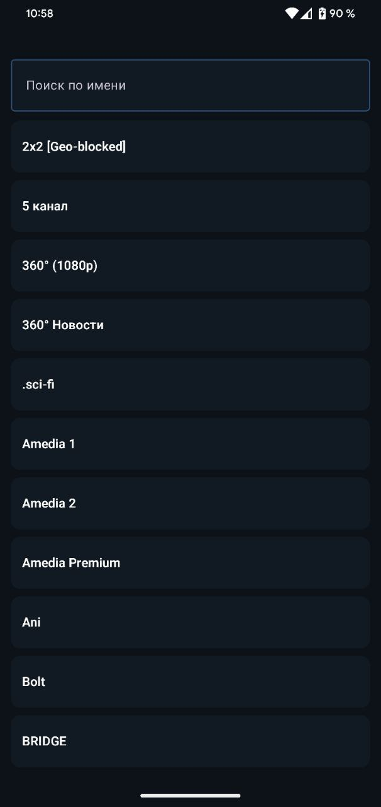
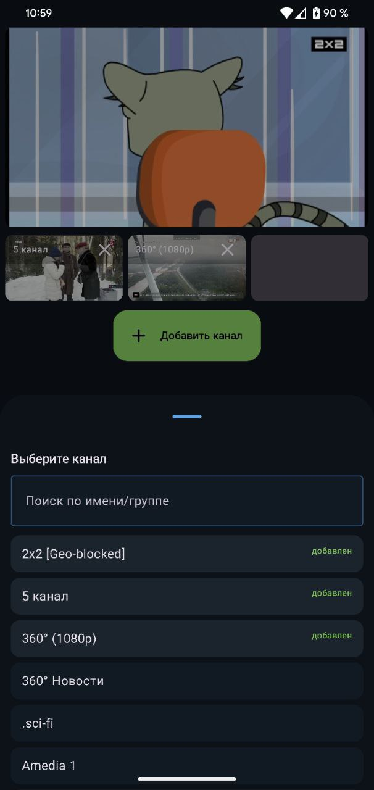

# AirTV — IPTV-приложение

## Описание

Android-приложение для просмотра HLS-потоков (эфирные каналы) с удобным выбором и управлением воспроизведением.

## Реализовано по ТЗ

- **Переключение канала** (вперёд/назад)
- **Выбор канала из списка** (поиск + список)
- **Замедление/ускорение воспроизведения** (0.5× / 1× / 1.5× / 2×)
- **TimeShift** — перемотка на доступное время в HLS-плейлисте
- **Zoom** — увеличение масштаба изображения (pinch-to-zoom, панорамирование)
- **Вывод нескольких каналов на одном экране** (1 основной + до 3 мини-плееров)

## Скриншоты

| Список каналов | Плеер | Мульти-просмотр | Добавление канала |
|---|---|---|---|
|  |  |  |  |

## Основные технологии

| Технология / Библиотека | Назначение |
|---|---|
| **Kotlin** | Язык разработки |
| **Jetpack Compose** | Декларативный UI |
| **Material 3** | Компоненты |
| **Navigation Compose** | Навигация |
| **Hilt (DI)** | Внедрение зависимостей |
| **AndroidX Media3 (ExoPlayer)** | Воспроизведение HLS |
| **Coroutines + Flow** | Асинхронность и стейт |
| **OkHttp + Retrofit** | Сетевой слой |

## Требования

- Android 7.0+ (API 24+)
- Доступ в интернет

## Скачать APK

Готовый `.apk` лежит в корне репозитория:

